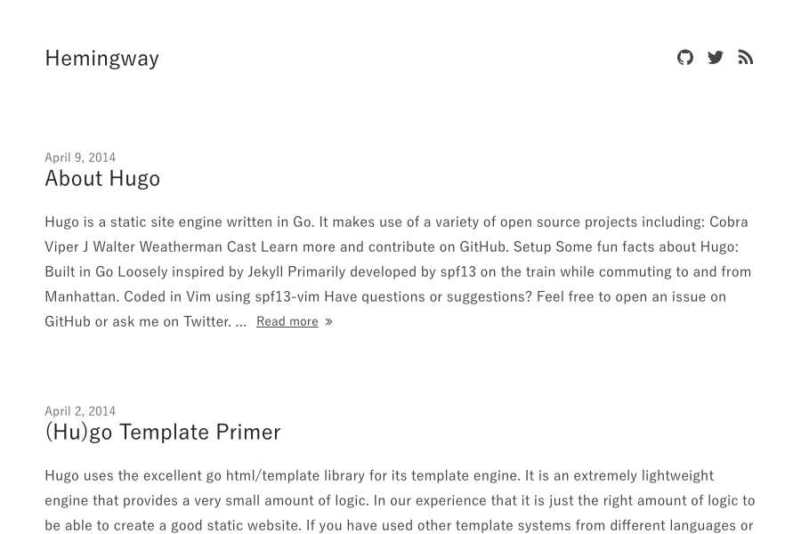

# Hemingway3

Hemingway3 is a really minimal blog theme for hugo and a [fork](https://github.com/tanksuzuki/hemingway).



## Getting Started

Clone this repository to your hugo theme directory.

```
mkdir themes
cd themes
git clone https://github.com/lony/hugo-hemingway3.git hemingway3
```

## Configuration

Take a look in the [exampleSite](exampleSite) folder.

This directory contains an example config file and the content for the demo.
It serves as an example setup for your documentation.

Copy the `config.toml` in the root directory of your website. Overwrite the existing config file if necessary.

__[config.toml](exampleSite/config.toml)__:

```toml
baseurl = "https://example.com"
languageCode = "en"
title = "Hemingway wrote"
theme = "hemingway3"
copyright = "&copy; <a href=\"https://github.com/tanksuzuki\">Asuka Suzuki</a> 2017"
disqusShortname = "shortname"
googleAnalytics = ""

[taxonomies]
tag = "tags"
category = "categories"

[params.meta]
description = "Your personal description"
keywords = ["keyword1", "keyword2"]
name = "Asuka Suzuki"

[params.highlight]
style = "github"
languages = ["go", "dockerfile"]

[[params.social]]
url = "https://github.com/tanksuzuki"
fa_icon = "fa-github"

[[params.social]]
url = "https://gitlab.com/beli3ver"
fa_icon = "fa-gitlab"

[[params.social]]
url = "https://twitter.com/tanksuzuki"
fa_icon = "fa-twitter"

[[params.social]]
url = "https://telegram.me/beli3ver"
fa_icon = "fa-telegram"

[[params.social]]
url = "/index.xml"
fa_icon = "fa-rss"
```

## Build

```
hugo server
```

You can go to [localhost:1313](http://localhost:1313) and this theme should be visible.

## License

Hemingway3 is licensed under the [MIT License](LICENSE.md).

## Author

* [Asuka Suzuki](https://github.com/tanksuzuki) - Creator
* [Malte Kiefer](https://github.com/beli3ver) - [Contributor](https://github.com/tanksuzuki/hemingway/compare/master...beli3ver:master)
* [Goetz Epperlein](https://github.com/lony) - [Contributor](https://github.com/beli3ver/hemingway2/compare/master...lony:master)
